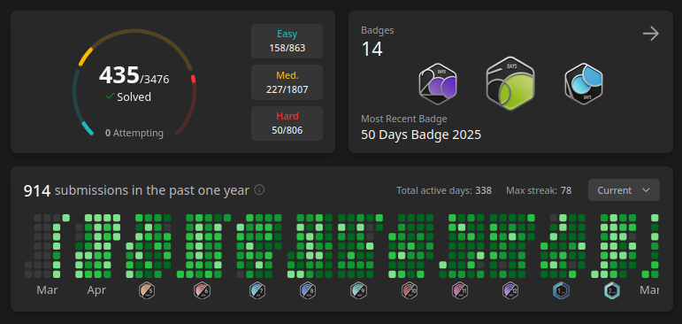

### Core Technical Stack

---

SWE & Product Engineer building <a href="https://terax.app">Terax</a>. Previously worked in fintech, AI startups, built a full metadata editor for photographers.

Among all of this, open-source and content creation is where I find the most purpose. And I'll continue building high-quality, actually useful FOSS projects for the community.

---

#### Leetcode stats in 2025, why not :) 

##### 📫  Contact: info@terax.app

